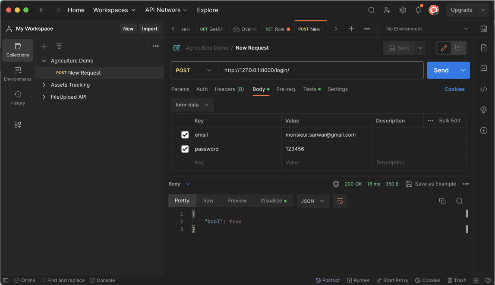
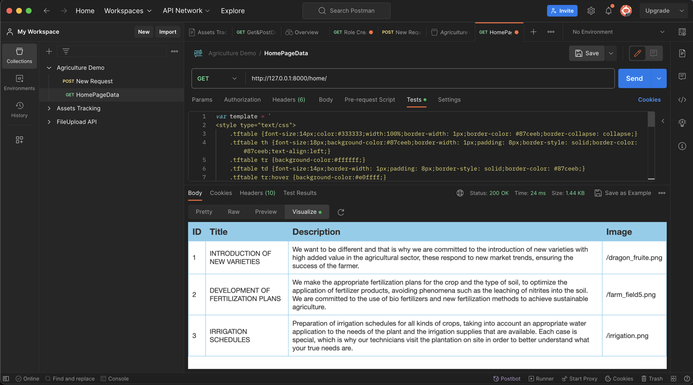

# Agriculture Backend in Django Demo

This is agricultural Demo Backend. Not connected with frontend yet. On the other hand, I've added screenshot of POSTMAN test.

Login Respose of POSTMAN

Home Page Data Response

if you wanna check by yourself, you can by just installing with some basic commands.

Project Run Command in your localhost or personal PC:

1. First you have to create virtual env by command 'python -m venv tenv'
2. Then activate the env by 'source tenv/bin/activate' for mac and 'tenv\Scripts\activate' for windows.
3. After that install dependencies and packages by command 'pip install -r requirements.txt'
4. For your convenient I've added the database file too. name is 'db.sqlite3', so that you don't need to migrate or create anything.
5. Then run the project using command 'python manage.py runserver'

<b>voila!!</b>

Then go to url
127.0.0.1:8000/login for seeing login data.
127.0.0.1:8000/home for seeing Home Page data.
